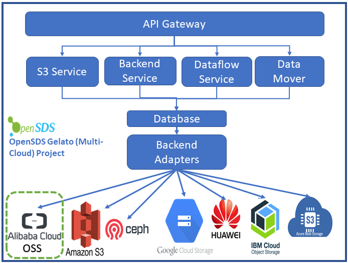
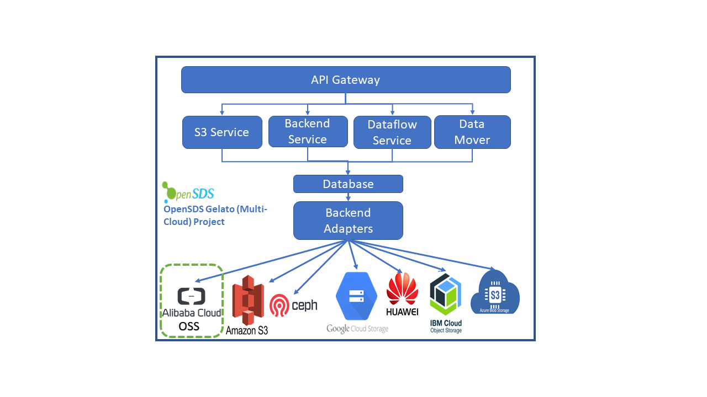

# Multi-Cloud Feature Enhancements: Abort Migration Feature

**Author(s):** Click2Cloud Inc (India)

## Summary

Using this feature, user will be able to abort running migration process.

## Motivation

In existing OpenSDS Gelato project, we don't have any option using which user can manage the ongoing object migration process (i.e. pause, resume and abort migration). So as an initial phase, we have worked on abort migration method for running migration job.

### Goals

* To abort migration

### Non-Goals

* To pause and resume migration.
* Use of Redis after YIG integration to control migration process.

## Design Details
FSM Model for object Migration

As shown below, when after receiving migration job request from dataflow, datamover will have a Finite State Machine Model which will hold the state of  migration job. We have check points at various points as shown in following figure which will check whether the job is aborted or not, if it is aborted then it will perform job cleaning steps, if required ( job cleaning steps in current patch is to delete fragments of multi-part upload on destination bucket using AbortMultipart method). Then it will stop the process smoothly. 

This is Nearly real-time process (for eg. if some object download request is called and then user requested to abort, abort process will wait for object to download and then stop the process)

### REST API impact

To abort migration process, we will have following API

POST: http://127.0.0.1:8089/v1/adminTenantId/jobs/{{ Job-ID }}/abort

Response:

        {
            "Id": "5bd6f273b0bdf90001dc91c3",
            "Status": "aborted",
        }

"Status": "aborted"/"cancelled"

If job is already completed, failed or aborted, it will show error 

# References

#### Abort migration using FSM model

1. https://github.com/vaughan0/go-fsm

2. https://github.com/looplab/fsm

### Other end user impact

* End user will get an option to abort running migration.
* It will not rollback the migrated objects. When user call abort migration request, it will not delete the objects migrated to destination bucket. If remainSource is false, the object migrated before abortmigration request will not be available in source bucket.
### Performance impact
