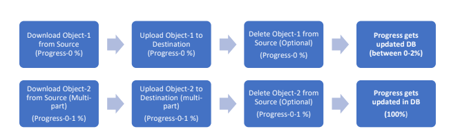
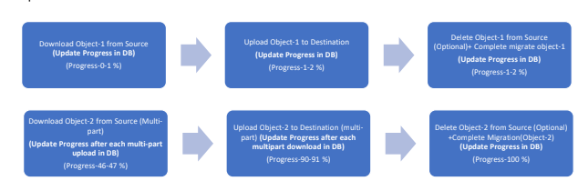
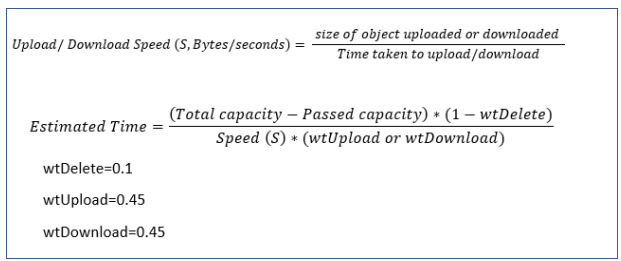
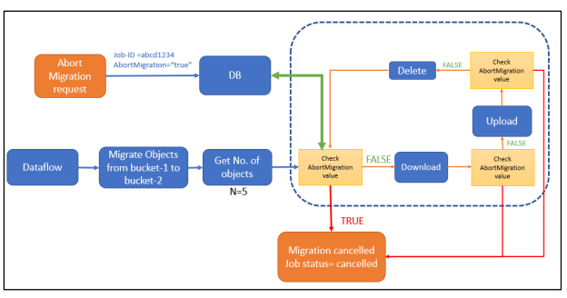
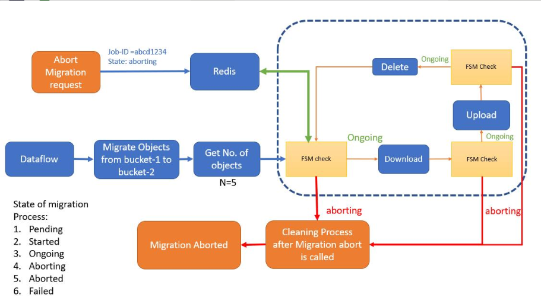

# Multi-Cloud Feature Enhancements: Progress, Time Estimation and Abort Migration Features

**Author(s):** Click2Cloud

# Background

On OpenSDS dashboard progress for migration increases when each object got migrated and it does not show the estimated time for migration process to complete. Also existing OpenSDS Multi-Cloud project do not support Abort migration method for running migration process.

# Goals
- To show Progress of object migration process which will increase gradually.
- To show estimated time to complete the migration.
- Add Abort Migration.

# Non-Goals
- Pause and Resume Migration.

# Architecture Diagram

#### Existing Progress calculation process

OpenSDS dashboard shows Progress for migration when it gets complete for e.g. to migrate 2
Objects: Object-1(100MB) and Object-2(1GB).

                         FIG: Existing Progress calculation process

#### Expected Progress calculation process
After every upload, download and delete process for single object or multi-part, progress should get
updated as shown below.

          
                        FIG: Expected Progress calculation process
   
   - To calculate progress, we will have to give weightage to each process for e.g.
   
 -  Download= 48%, Upload= 48 % and Delete= 4%
   
  - For Object of size 100MB it will be distributed as shown below:
   
  - Download Object (100MB)  Progress= 48
   
 -  Upload 100MB             Progress= 96 (48+48)
   
 -  Delete Object            Progress= 100 (48+48+4)
   
  - If _“remainSource”_ parameter is _“True”_ then we can use 50-50 weightage to upload and
   download.
   
  -  Need to handle progress when multi-part process gets failed.
  
 #### Time estimation for migration process
 
 For time estimation following method is used :
 
 
 
                      FIG: Time estimation for migration process
  
  
####   Abort-migration

##### a.Database method
Add 1 parameter AbortMigration in database,

In migration process, after migration of each object, it will check the value of “AbortMigration”,
if it is “false” then it will continue migration process for further objects and if it is assigned as
“true” it will break the process and come out of for loop.   

Default value of “AbortMigration” is “False”

                        FIG: Abort-migration Process
                        

     
  
 ##### b.Finite State Machine method an using code (Preferable)       
 
 - We are working on another approach in which using code and less interaction with database,
   one can pause, resume or cancel the process (preferable).
   
 - Finite State Machine (FSM, ref: https://github.com/looplab/fsm) will manage the
   migration process i.e. abort migration smoothly (in future we will add pause,
   resume, restart feature too.)
   
 - Use cache in managing migration process for good performance.
  
  
  
                        FIG: Abort-migration using FMS model 
 
#  Abort API

##### a. Database method
For each Job we will maintain following values in database:

{

"Id": "5bd6f273b0bdf90001dc91c3",

"AbortMigration": "true",

}

To abort migration process, we will have following API

POST: http://127.0.0.1:8089/v1/adminTenantId/jobs/{{ Job-ID }}/abort

Response:

{

"Id": "5bd6f273b0bdf90001dc91c3",

"JobStatus": "aborted",

}

# References

#### Abort migration using FSM model

1. https://github.com/vaughan0/go-fsm

2. https://github.com/looplab/fsm

3. https://github.com/rynorris/fsm

4. https://github.com/Zumata/fsm

5. https://github.com/yandd/fsm
